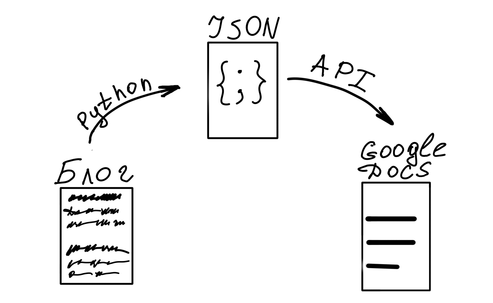
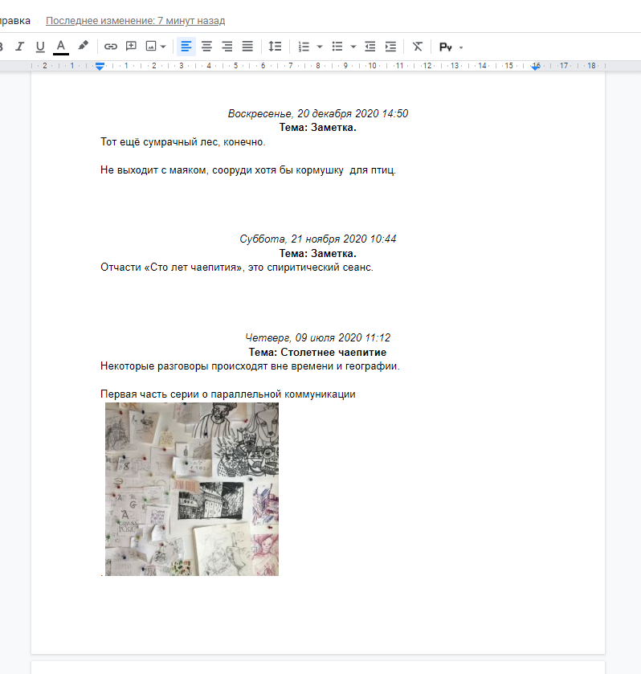

# Проект о том, как скопировать блог. 


Оглавление: 
- [Постановка задачи](#task)
- [Схема работы программы](#schema)
- [Парсинг](#parsing)
- [Экспорт в Google Docs](#export)
- [Результаты](#result)


## <a name="task">Постановка задачи</a>

**Проблема**: пользователь ведет блог на платформе, которая вот-вот закроется. Терять написанное годами он не хочет. Хочет сохранить для истории все, что писал, с картинками.

**Задача**: скопировать содержимое блога с блог-платформы в контролируемое пользователем место. 

**Используемые технологии**: Python, BeautifulSoup, Google Docs API


## <a name="schema">Схема работы программы</a>



## <a name="parsing">Парсинг</a>

1. На вход программе подается адрес блога, с помощью request получаем первую страницу блога.
2. Программа парсит страницу блога. Она обычно состоит из нескольких постов. Пост состоит из элементов: заголовок, контент, дата, время, кол-во комментариев, url-поста. Значение каждого элемента записываются в словарь "Пост", этот словарь затем добавляется в качестве элемента словаря "Блог"
3. После парсинга всей страницы, ищется ссылка на следующую страницу, и следующая страница загружается.  
4. Предыдущие два пункта повторяеем, пока страницы не закончатся.
5. Словарь "Блог" записывается в JSON

## <a name="export">Экспорт в Google Docs</a>

У меня было несколько вариантов, где сохранять содержимое блога: MS Word, Google Docs, Блокнот или оставить сырой JSON. Варинт с вордом хороший, но недоступный из онлайна, а в 2021 - это важно. Можно, конечно, выгрузить его в Google Docs, но зачем лишние движения, если можно сразу. В блокнот не вставить картинки, а JSON не поймут блондинки. 

6. Создаем по [гайду гугла](https://developers.google.com/docs/api/quickstart/python#step_3_set_up_the_sample) заготовку для работы с Google Docs (аналог ворда) - пустой документ.
7. Пробегаемся по JSON, и в каждом элементе "Пост", записываем в переменные значение элементов эже самого "Поста". 
8. Анализируем содержимое элемента "Контент". В нем может быть форматирование текста, картинки, ссылки.
9. С помощью Google Docs API вставляем в документ каждый элемент и одновременно задаем ему форматирование его абзазу. 
10. Повторяем предыдущие два пункта для всех элементов "Пост"
11. У Google API если лимиты на использование. После нескольких десяток вставок нужно запустить таймер и ждать заданный таймаут. 


## <a name="result">Результаты</a>
Программа работает не быстро из-за таймаутов гугла, но поставленная задача решена.

Часть сформированного JSON случайного блога:
```
...
    "post220266050": {
        "header": "Заметка.",
        "content": ["Тот ещё сумрачный лес, конечно. ", "<br/>", "<br/>", "Не выходит с маяком, сооруди хотя бы кормушку  для птиц."],
        "date": "Воскресенье, 20 декабря 2020",
        "time": "14:50",
        "commentcount": "2",
        "url": "...p220266050_zametka.htm"
    },
    "post220162636": {
        "header": "Заметка.",
        "content": ["Отчасти «Сто лет чаепития», это спиритический сеанс."],
        "date": "Суббота, 21 ноября 2020",
        "time": "10:44",
        "commentcount": 0,
        "url": "...p220162636_zametka.htm"
    },
    "post219657688": {
        "header": "Столетнее чаепитие",
        "content": ["Некоторые разговоры происходят вне времени и географии. ", "<br/>", "<br/>", "Первая часть серии о параллельной коммуникации.", "<br/>", ""],
        "date": "Четверг, 09 июля 2020",
        "time": "11:12",
        "commentcount": "6",
        "url": ...p219657688_stoletnee-chaepitie.htm"
    }
}
```

Результат экспорта в Google Docs:


